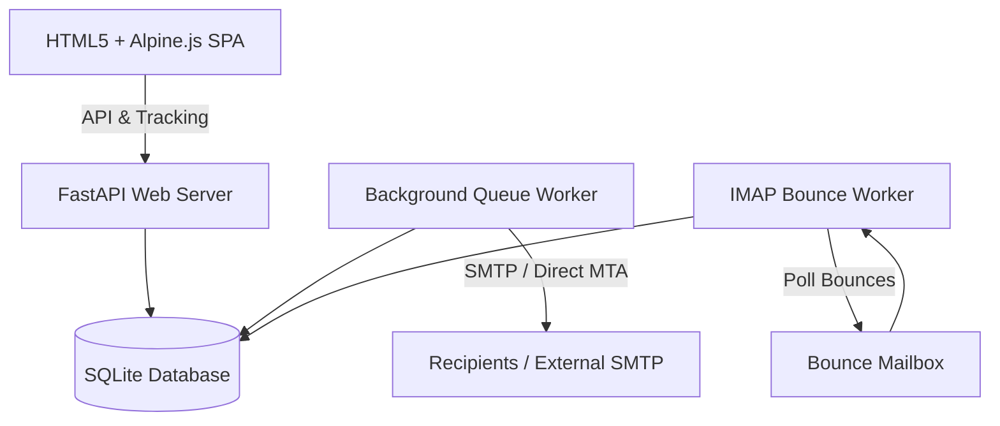

# PolyPress

<p align="center">
  
</p>

**PolyPress** is a premium, self-hosted, multitenant email newsletter management system. Designed to replace commercial newsletter tools, it offers strong data privacy, white-labeling capabilities, OIDC authorization, and flexible sending profiles (external SMTP relays or an internal direct-sending MTA).

## Key Features

1. **Multitenancy**: Domain-scoped subscriber lists, campaigns, and configurations.
2. **Global OIDC Login**: Single sign-on authentication with role management (Super Admin vs. Tenant Admin).
3. **Internal MTA (Direct Send)**: Resolves MX records of recipient domains directly and delivers emails without using third-party relays.
4. **DKIM Signature Layer**: Generates 2048-bit RSA key pairs per domain and displays the DNS TXT record layout directly in the UI.
5. **IMAP Bounce Processor**: Periodically polls a configured bounce mailbox to parse DSNs (delivery status notifications) and ARF (Abuse Report Format) spam reports, auto-flagging bad contacts.
6. **Visual Newsletter Builder**: Inline block editor (Heading, Paragraph, Button, Image, Divider, Spacer) with template compile engine and subscriber merge tags.
7. **Double Opt-In Flow**: Per-domain toggle sends responsive verification emails to pending subscribers with activation links.
8. **Visual Mock Previews**: Renders newsletter templates inside the browser with live subscriber merge-tag variable overrides.
9. **RFC 8058 One-Click Unsubscribe**: Appends `List-Unsubscribe` headers to support direct client-side unsubscribes.
10. **Outbox Queue Board**: Displays pending/deferred sends, MX responses, retry intervals, and allows purging queue items.
11. **Developer REST API & HMAC Webhooks**: API Key authentication for programmatic subscriber additions, and secure HMAC-SHA256 signed event postbacks.
12. **In-Process Let's Encrypt SSL (ACME)**: Acquire Let's Encrypt certificates directly inside the Admin console with automatic in-process HTTP-01 challenge routing.
13. **White Label System**: Brand custom naming and logo support.
14. **Parallel Send & Retries Queue**: Multithreaded sending workers with token bucket rate limits, continuous transient failures retry logic, and active pause/resume buttons.
15. **Engagement Stars & Targeting**: Asynchronous 1-5 star hygiene rating based on subscriber open/click activity ratios, advanced multi-filters, and segmented targeting constraints.
16. **Hot Backup snap-restore System**: High-portability backups zip packages database files and branding assets. Handles SQLAlchemy pool disposals for transparent restores.
17. **Click Map Visualizer**: Sandy iframe overlays showing click statistics directly on top of matching newsletter links.

---

## Architecture Diagram



---

## System Requirements

Before running the installer, make sure your hosting server or local machine meets these minimal requirements:

### 1. Hardware
PolyPress is lightweight, using zero-configuration SQLite storage. It runs comfortably on low-resource machines:
- **Processor**: 1 CPU core is plenty.
- **Memory (RAM)**: 512 MB minimum (1 GB recommended).
- **Disk Space**: Less than 100 MB for base files, plus a small amount of storage for subscriber databases.

### 2. Software Prerequisites
PolyPress is built for Linux. To prepare your system:
- **Python**: Version `3.8` or higher.
- **Dependencies Helper**: On Debian/Ubuntu systems, install python utilities by running:
  ```bash
  sudo apt update
  sudo apt install python3-pip python3-venv -y
  ```

### 3. Network Ports
- **Dashboard Access (Port 8000)**: Used to connect to the GUI console locally.
- **Let's Encrypt SSL (Port 80)**: *Optional.* If you plan to use the built-in **GUI Let's Encrypt Creator**, your server must be publicly reachable on port `80` (HTTP) so Let's Encrypt can perform challenge validations.
- **Outbound Mail MTA (Port 25)**: *Optional.* If you use **Direct Send Mode** (built-in MTA), your hosting provider must allow outbound connections on Port `25`. *Note: Most cloud providers (like DigitalOcean, AWS) and home ISPs block port 25 to prevent spam. If blocked, simply configure an external SMTP Relay (like SendGrid, Resend, or SES) on port 587 or 465.*

---

## Installation & Setup

### 1. Automated Installation
We provide an easy `install.sh` bootstrap script that checks for requirements, prepares a Python virtual environment, and installs all dependencies automatically:

```bash
./install.sh
```

### 2. Run the Server
Activate the virtual environment and start the FastAPI backend:
```bash
source venv/bin/activate
cd backend
uvicorn main:app --host 0.0.0.0 --port 8000
```

### 3. First Open Setup Wizard
When you open http://localhost:8000 in your browser for the first time, PolyPress will guide you through an interactive setup wizard to configure:
- **Branding Name**: The custom name of your PolyPress installation.
- **Super Admin Credentials**: The email and secure password for your host administrator account.
- **Email Transports (Outbound)**: Setup direct MTA sending with DKIM or configure an SMTP relay.
- **Bounce Inbox (Inbound)**: Configure the IMAP mail handler details to auto-process bounces.

Once complete, your credentials are saved, database schemas are fully established, and you are automatically logged in!

---

## Configuration & Usage

### OIDC Configuration (Super Admin)
1. Login as `admin@polypress.local` and click **Global Admin** in the sidebar.
2. Enable OIDC login and provide your provider issuer URI (e.g. Authentik, Keycloak, or Okta), Client ID, and Client Secret.
3. Configure the **Allowed Domains** whitelist (e.g. `yourcompany.com`) to restrict registration.
4. Toggle **Auto-Create Tenant** to automatically register a company tenant whenever a new OIDC email domain logs in.

### Sending Settings (Tenant Admin)
Navigate to **Sending Settings** to configure your outbound strategy:
- **External SMTP Relay**: Enter SMTP host, port, username, password, and SSL/TLS preferences.
- **Direct Send (Internal MTA)**: Enter your sending domain (e.g. `yourcompany.com`). Generate a DKIM key pair, copy the host name (`polypress._domainkey.yourcompany.com`) and TXT record value (includes the base64 public key), and add it to your domain's DNS registry.
- **IMAP Bounce Processor**: Enter the IMAP host, username, password, and port for the mailbox receiving return-path emails.

### Contacts & CSV Import
1. Create a subscriber list under **Subscriber Lists**.
2. Select **Fields Schema** to add list-specific custom attributes (e.g. `city`, `gender`).
3. Click **CSV Import** to select your file, map CSV headers to target attributes, and launch the importer.
4. Obtain the embeddable signup form snippet by clicking **Embed Form**.

---

## Verification & Testing

Verify mail transport, open/click counts, and bounce workers using mock configs.
For questions or issues, consult the logs generated in the standard server output (or view service logs with `journalctl -u polypress -f` if running as a systemd service).

---

## Clean Uninstallation

To cleanly stop the background service, delete python dependencies, and optionally wipe database tables and local TLS certificates, run:
```bash
./uninstall.sh
```
This leaves your system completely clean.
