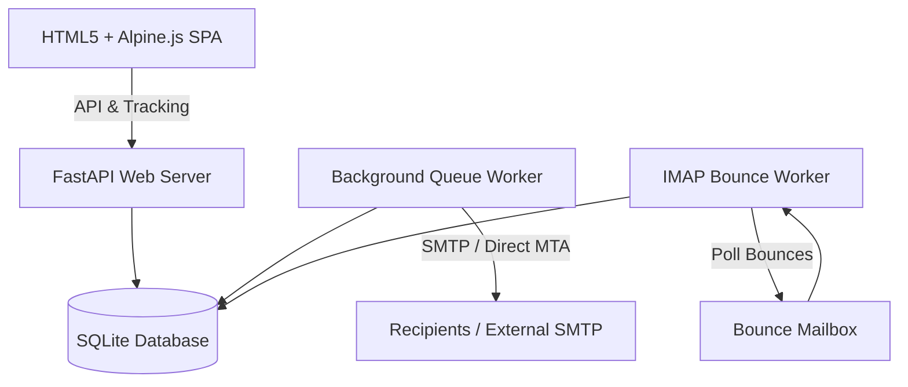

# PolyPress

<p align="center">
  
</p>

**PolyPress** is a premium, self-hosted, multitenant email newsletter management system. Designed to replace commercial newsletter tools, it offers strong data privacy, white-labeling capabilities, OIDC authorization, and flexible sending profiles (external SMTP relays or an internal direct-sending MTA).

## Key Features

1. **Multitenancy**: Domain-scoped subscriber lists, campaigns, and configurations.
2. **Global OIDC Login**: Single sign-on authentication with role management (Super Admin vs. Tenant Admin).
3. **Internal MTA (Direct Send)**: Resolves MX records of recipient domains directly and delivers emails without using third-party relays.
4. **DKIM Signature Layer**: Generates 2048-bit RSA key pairs per domain and displays the DNS TXT record layout directly in the UI.
5. **IMAP Bounce Processor**: Periodically polls a configured bounce mailbox to parse DSNs (delivery status notifications) and ARF (Abuse Report Format) spam reports, auto-flagging bad contacts.
6. **Visual Newsletter Builder**: Inline block editor (Heading, Paragraph, Button, Image, Divider, Spacer) with template compile engine and subscriber merge tags (e.g. `{{name}}`, `{{email}}`, custom attributes).
7. **CSV subscriber import**: Drag-and-drop CSV importer with custom database header mapping matching flexible subscriber list schemas domain-to-domain.
8. **Metrics & Dynamic Open/Click Tracking**: Injects open tracking pixels and rewrites hyperlinks to capture clicks and opens dynamically.
9. **White Label System**: Brand custom naming and logo support.

---

## Architecture Diagram



---

## Installation & Setup

### 1. Automated Installation
We provide an easy `install.sh` bootstrap script that checks for requirements, prepares a Python virtual environment, and installs all dependencies automatically:

```bash
./install.sh
```

### 2. Run the Server
Activate the virtual environment and start the FastAPI backend:
```bash
source venv/bin/activate
cd backend
uvicorn main:app --host 0.0.0.0 --port 8000
```

### 3. First Open Setup Wizard
When you open http://localhost:8000 in your browser for the first time, PolyPress will guide you through an interactive setup wizard to configure:
- **Branding Name**: The custom name of your PolyPress installation.
- **Super Admin Credentials**: The email and secure password for your host administrator account.
- **Email Transports (Outbound)**: Setup direct MTA sending with DKIM or configure an SMTP relay.
- **Bounce Inbox (Inbound)**: Configure the IMAP mail handler details to auto-process bounces.

Once complete, your credentials are saved, database schemas are fully established, and you are automatically logged in!

---

## Configuration & Usage

### OIDC Configuration (Super Admin)
1. Login as `admin@polypress.local` and click **Global Admin** in the sidebar.
2. Enable OIDC login and provide your provider issuer URI (e.g. Authentik, Keycloak, or Okta), Client ID, and Client Secret.
3. Configure the **Allowed Domains** whitelist (e.g. `yourcompany.com`) to restrict registration.
4. Toggle **Auto-Create Tenant** to automatically register a company tenant whenever a new OIDC email domain logs in.

### Sending Settings (Tenant Admin)
Navigate to **Sending Settings** to configure your outbound strategy:
- **External SMTP Relay**: Enter SMTP host, port, username, password, and SSL/TLS preferences.
- **Direct Send (Internal MTA)**: Enter your sending domain (e.g. `yourcompany.com`). Generate a DKIM key pair, copy the host name (`polypress._domainkey.yourcompany.com`) and TXT record value (includes the base64 public key), and add it to your domain's DNS registry.
- **IMAP Bounce Processor**: Enter the IMAP host, username, password, and port for the mailbox receiving return-path emails.

### Contacts & CSV Import
1. Create a subscriber list under **Subscriber Lists**.
2. Select **Fields Schema** to add list-specific custom attributes (e.g. `city`, `gender`).
3. Click **CSV Import** to select your file, map CSV headers to target attributes, and launch the importer.
4. Obtain the embeddable signup form snippet by clicking **Embed Form**.

---

## Verification & Testing

Verify mail transport, open/click counts, and bounce workers using mock configs.
For questions or issues, consult the logs generated in the standard server output.
