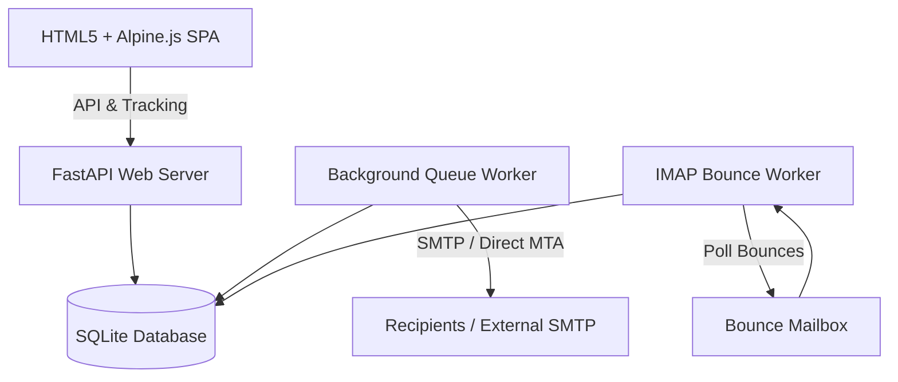

# PolyPress

<p align="center">
  
</p>

**PolyPress** is a premium, self-hosted, multitenant email newsletter management system. Designed to replace commercial newsletter tools, it offers strong data privacy, white-labeling capabilities, OIDC authorization, multi-domain SMTP connection pooling, automated bot/security scanner filtering, and flexible sending profiles (external SMTP relays or an internal direct-sending MTA).

---

## 📖 Detailed Documentation (GitHub Wiki)

All configuration guides, API endpoints, and features documentation have been moved to the [**GitHub Wiki**](https://github.com/TylerHats/PolyPress/wiki):

*   [**Installation & Setup**](https://github.com/TylerHats/PolyPress/wiki/Installation-and-Setup) — Detailed system requirements, automated setup, Docker / Portainer deployments, and onboarding.
*   [**Architecture & Security**](https://github.com/TylerHats/PolyPress/wiki/Architecture-and-Security) — Workspace multitenancy, OIDC single sign-on mapping rules, database configurations, and auto-backups.
*   [**Outbound Transports & MTA**](https://github.com/TylerHats/PolyPress/wiki/Outbound-Transports-and-MTA) — Direct MTA (Direct Send), global fallback SMTP relays, DKIM generation, and rate limits.
*   [**Bounce & Complaint Handling**](https://github.com/TylerHats/PolyPress/wiki/Bounce-and-Complaint-Handling) — Automatic bounce mailbox IMAP scanners and incoming webhook relays.
*   [**Contacts Import & Preference Center**](https://github.com/TylerHats/PolyPress/wiki/Contacts-Import-and-Preference-Center) — Delimiter-selectable CSV imports, fields schema control, subscription preference centers, and list hygiene.
*   [**Visual Email Designer**](https://github.com/TylerHats/PolyPress/wiki/Visual-Email-Designer) — Layout components, nested conditional blocks, split testing, and diagnostics.
*   [**Marketing Automations**](https://github.com/TylerHats/PolyPress/wiki/Marketing-Automations) — Visual flow building, filters, delay steps, and IF/ELSE branching pathways.
*   [**Developer REST API & Webhooks**](https://github.com/TylerHats/PolyPress/wiki/Developer-REST-API-and-Webhooks) — Integrations, transactional direct mail dispatches, and webhook payload verifications.

---

## 🛠️ High-Level System Architecture



---

## ⚡ Quick Start

### 1. Requirements
*   **OS**: Linux (Ubuntu/Debian recommended).
*   **Python**: Version 3.8 or higher.
*   **Docker** (Optional for container deployments).

### 2. Automated Bootstrap Installation
```bash
./install.sh
```

To run manually:
```bash
source venv/bin/activate
cd backend
uvicorn main:app --host 0.0.0.0 --port 8000
```

### 3. Docker Compose Deployment
```bash
docker compose up -d
```

Open http://localhost:8000 in your browser to go through the First-Open setup wizard.

---

## 🧹 Clean Uninstallation
To cleanly stop background services, delete Python virtual environment packages, and optionally purge data folders, run:
```bash
./uninstall.sh
```
